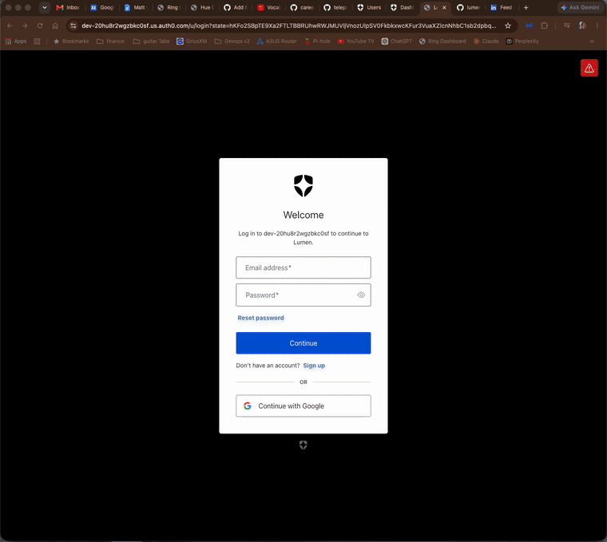

# Lumen



A Philips Hue control portal built as an **identity-engineering study**: real
Auth0 OIDC login for the human, and an LLM agent whose authority over the home is
bounded by an explicit, enforced scope grant. The lighting is the demo surface;
the access model is the point.

```
                  ┌── OIDC Authorization Code (Authlib) ──┐
   browser ───────┤                                       ├──> Auth0 tenant
      │           └── ID token (RS256) validated vs JWKS ─┘     (issuer / JWKS)
      │  session cookie
      ▼
    Lumen  ──(scope-checked tool dispatch)──>  chat agent  ──>  Hue v2 bridge
```

## Identity model

**Human authentication — OIDC Authorization Code flow.**
Login is delegated to Auth0 as the OpenID Provider. Lumen is a confidential
Regular Web Application using `client_secret` at the token endpoint and the
`openid profile email` scopes. On callback, the returned **ID token is an
Auth0-signed RS256 JWT, validated offline against the tenant's JWKS** — signature,
`iss`, `aud`, and `exp` all checked, with no per-request call back to Auth0. The
JWKS is fetched once and cached; key rotation is handled by `kid` lookup. Authlib
performs the validation rather than hand-rolled crypto — the deliberate choice for
a security-sensitive path.

**Agent authorization — least privilege for a non-human identity.**
The chat agent is treated as a non-human identity with its own capability grant
(`AGENT_SCOPES`), independent of what the logged-in human can do. The grant is
enforced in two places, defense in depth:

1. **Capability hiding** — the model is only handed the tools its grant permits
   (`agent/tools.py::granted_tools`). It cannot call what it cannot see.
2. **Execution-time check** — every tool call is re-validated against the grant in
   `agent/runner.py::_dispatch` before it runs, so a hallucinated or
   prompt-injected call to a withheld tool is refused regardless of what the model
   emitted.

The tool list itself is the capability boundary, and it is read-plus-recall only:
read room state, list scenes, set power, set brightness, recall an **existing**
scene. There is deliberately no create/delete tool, so "the agent never authors or
destroys anything" is true by construction, not by instruction.

```
tool            required scope    effect
list_rooms      lights:read       all rooms: power + brightness
room_status     lights:read       one room's state
list_scenes     lights:read       scenes available in a room
set_power       lights:write      on / off
set_brightness  lights:write      1-100
activate_scene  scenes:write      recall an existing scene
```

## What is real vs. roadmap

Being precise, because it matters for an access-control project:

- **Real today:** human OIDC login, offline RS256/JWKS ID-token validation, the
  two-layer scope enforcement on every agent action, and a tool surface with no
  authoring capability.
- **Roadmap (the honest next step):** `AGENT_SCOPES` is currently enforced from
  configuration, not carried as a token. The principled version gives the agent
  its **own Auth0 M2M client**, mints it an access token scoped to exactly those
  permissions via the client-credentials grant, and validates that token's scopes
  on each tool call. The grant then lives in the IdP — centrally revocable and
  auditable — instead of a config string. That is the non-human-identity
  governance version of this design, and the codebase is structured to drop it in
  at `_dispatch`.

## Why this shape

Autonomous agents are non-human identities that act with real privilege, and the
current industry failure mode is handing them broad access "to make it work." This
project is a small, working argument for the opposite: an agent constrained to
least privilege at the identity layer, where the constraint holds no matter what
the prompt asks. The Hue bridge is just a tangible thing to be over-permissioned
*against*.

## Run it

Mock mode needs no bridge and no LLM key — only an Auth0 app — so the auth flow is
demonstrable on its own.

```bash
python3 -m venv .venv && source .venv/bin/activate
pip install -e .
cp .env.example .env        # MOCK_HUE / MOCK_LLM default to true
uvicorn hue_async.web.app:app --reload --port 5000
# open http://localhost:5000  -> redirected to Auth0 login
```

**Auth0 setup** — create a Regular Web Application and set:
- Allowed Callback URLs: `http://localhost:5000/callback`
- Allowed Logout URLs: `http://localhost:5000`

Then put its Domain / Client ID / Client Secret in `.env`. The host (`localhost`
vs `127.0.0.1`) must match `WEB_BASE_URL` and the URL you open.

**Going live:**
- `MOCK_HUE=false` + `HUE_BRIDGE_IP` + `HUE_USERNAME` (mint the app key by pressing
  the bridge link button, then
  `curl -k -X POST https://<ip>/api -d '{"devicetype":"lumen#app","generateclientkey":true}'`).
- `MOCK_LLM=false` + `ANTHROPIC_API_KEY` for the LLM agent; otherwise a built-in
  name-aware parser handles commands with no key (scope enforcement is identical
  on both paths).

## Layout

```
src/hue_async/
  core/config.py           settings (pydantic-settings)
  clients/hue_client.py    thin Hue v2 HTTP client
  services/room_service.py rooms / scenes / state
  agent/tools.py           tools + required scopes (the capability boundary)
  agent/runner.py          scope dispatch | Anthropic tool loop | offline parser
  agent/fake_service.py    runs with no bridge
  web/auth.py              Auth0 OIDC login + JWKS-validated callback
  web/chat.py              agent + room/scene JSON actions
  web/app.py               dashboard + per-room pages
  web/templates/           base | dashboard | room
```

## Stack

FastAPI - Authlib (OIDC) - PyJWT (JWKS) - Anthropic (optional) - Hue CLIP v2 -
pydantic-settings - Jinja2.